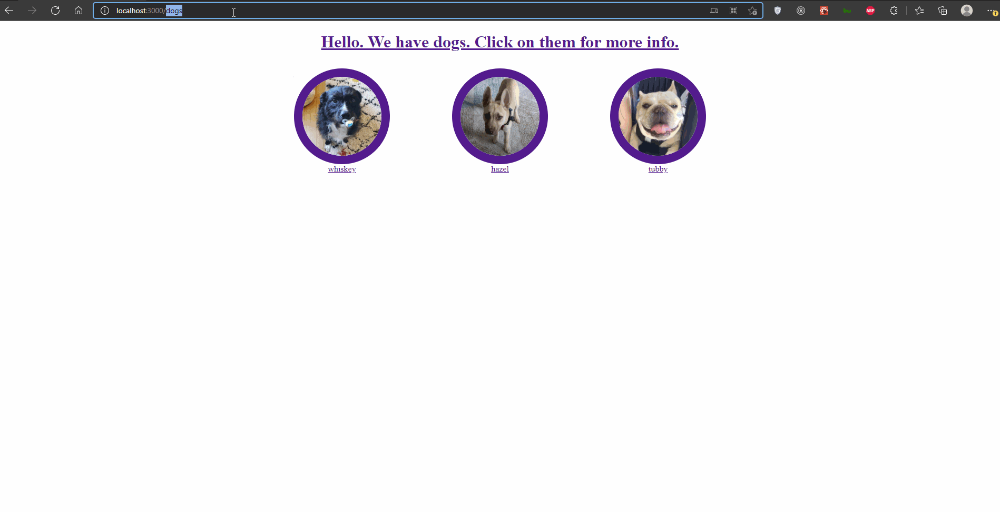

# React Router Dog Finder

Baue eine App, die zu verschiedenen Hunden routen kann und Informationen über den Hund anzeigt, wenn du auf der Route bist.

Die Routen sehen wie folgt aus:

- `/Dogs` ist die Startseite und zeigt im Titel _"Hallo"_ als Text und alle drei Hunde.
- Wenn du auf der Startseite auf das _Bild_ eines Hundes klickst, gelangst du zur Route des Hundes. Wenn du z.B. auf Whiskey klickst, kommst du zur Hundeinformationsseite _/Hunde/Whiskey_.
    - Verwende die gleichen Hundenamen wie auf den Bildern. __whiskey, tubby, hazel__
    - Die Hundeinfoseite sollte _"Alter"_ und _das Bild des Hundes_ enthalten, wenn es `this.props.currentDog` gibt.
- Wenn du auf den _"Hallo"_ Titel der Hunde klickst, gelangst du zur Homepage `/dogs`.
- und jeder andere Endpunkt, der nicht aufgeführt ist, sollte dich zu `/dogs` weiterleiten.
- Die App hat zwei Routen:
    - `/dogs`
    - `/dogs/:name`
    - Beide geben die Komponente `Dogs` wieder.
- Die "Dogs"-Karte sollte über die Hundeinformationen gehen und für jeden Hund eine "Dog"-Komponente darstellen.

Hier ist ein Bild davon, wie die App aussieht. Sie sollte genauso aussehen, wenn du sie umgestaltet hast!

